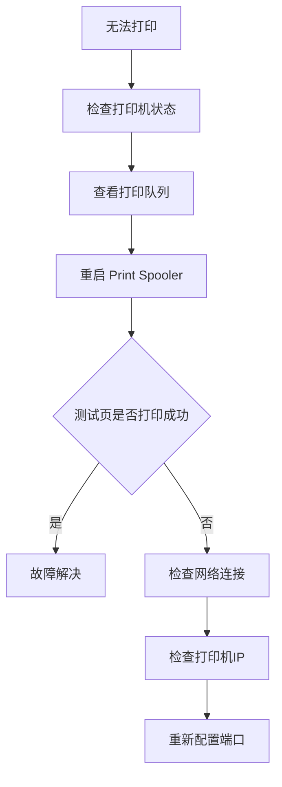

# 🖨️ HP 网络打印机故障排查与 TCP/IP 端口优化指南


> 一次真实的 HP LaserJet Professional M1216nfh MFP 网络打印机故障排查记录，涵盖 Print Spooler 修复、WSD 转 TCP/IP 端口优化以及企业环境最佳实践。

---

## 📋 设备信息

| 项目 | 内容 |
|------|------|
| 打印机型号 | HP LaserJet Professional M1216nfh MFP |
| 连接方式 | 网络打印机 |
| 原端口 | WSD |
| 优化后端口 | Standard TCP/IP Port |
| 当前 IP | 192.168.0.193 |
| 操作系统 | Windows |

---

## 🚨 故障现象

- 点击打印没有反应
- 打印任务停留在队列中
- 测试页无法打印
- Windows 显示“需要注意”
- 打印机图标正常但无法输出

---

## 🔍 故障排查流程



---

## ✅ 第一步：检查打印机状态

路径：

```text
控制面板
└── 设备和打印机
```

确认以下项目：

- [x] 打印机已识别
- [x] 驱动安装正常
- [x] 非脱机状态
- [x] 默认打印机正常

---

## ✅ 第二步：检查打印队列

```text
右键打印机
└── 查看现在正在打印什么
```

如果发现：

```text
测试页
↓
持续停留在队列中
↓
打印机无任何动作
```

说明：

> Windows 已生成打印任务，但未成功发送到打印机。

---

## ✅ 第三步：重启 Print Spooler

### 图形界面方式

```text
Win + R
↓
services.msc
↓
Print Spooler
↓
重新启动
```

### 命令行方式

```cmd
net stop spooler
net start spooler
```

---

## 🎯 故障根因

本次故障最终定位为：

```text
Print Spooler 服务异常
```

重启后：

- ✅ 测试页恢复正常
- ✅ 打印任务恢复
- ✅ 打印机通信正常

---

## ⚙️ WSD 与 TCP/IP 对比

| 对比项 | WSD | TCP/IP |
|----------|----------|----------|
| 自动发现 | ✅ | ❌ |
| 稳定性 | ⭐⭐ | ⭐⭐⭐⭐⭐ |
| 企业环境 | ⭐⭐ | ⭐⭐⭐⭐⭐ |
| 故障率 | 较高 | 较低 |
| 推荐程度 | 不推荐长期使用 | 推荐 |

### 推荐方案

```text
固定IP
    ↓
TCP/IP端口
    ↓
所有电脑统一连接
```

---

## 🔧 WSD 转 TCP/IP 操作步骤

### 添加新端口

```text
打印机属性
└── 端口
    └── 添加端口
        └── Standard TCP/IP Port
```

### 输入打印机 IP

```text
192.168.0.193
```

生成端口：

```text
IP_192.168.0.193
```

### 切换端口

取消：

```text
WSD-xxxxxx
```

勾选：

```text
IP_192.168.0.193
```

保存并打印测试页。

---

## 🌐 如何判断 IP 是否变化

### Ping 测试

```cmd
ping 192.168.0.193
```

### 返回正常

```text
Reply from 192.168.0.193
```

说明：

- 网络正常
- 打印机在线

### 返回失败

```text
Request timed out
```

可能原因：

- 打印机关机
- 网络异常
- IP 已发生变化

---

## 🛠️ 常见故障速查表

| 现象 | 原因 | 解决方案 |
|--------|--------|--------|
| 队列卡住 | Print Spooler异常 | 重启服务 |
| 打印机脱机 | 网络异常 | 检查IP |
| 测试页失败 | 端口异常 | 检查TCP/IP配置 |
| 找不到打印机 | IP变更 | 重新发现设备 |
| 打印缓慢 | WSD问题 | 改用TCP/IP |

---

## 🏢 企业环境最佳实践

推荐由 IT 部门配置：

- 固定 IP 地址
- DHCP 保留
- TCP/IP 端口连接
- 官方 HP 驱动
- 统一部署

避免：

- 长期使用 WSD
- 自动获取不固定 IP
- 使用通用驱动

---

## 📝 本次案例总结

### 故障原因

```text
Print Spooler 服务异常
```

### 解决方案

```text
重启 Print Spooler
```

### 优化方案

```text
WSD
↓
Standard TCP/IP Port
```

### 最终结果

- ✅ 打印功能恢复
- ✅ 测试页正常
- ✅ 网络通信正常
- ✅ TCP/IP 优化完成

---

## 📚 关键词

```text
HP Printer
Print Spooler
TCP/IP Port
WSD
Windows
Network Printer
IT Support
Printer Troubleshooting
```
