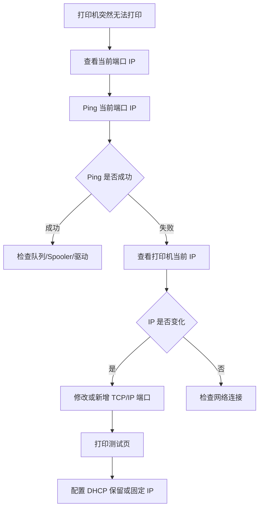

# 打印机 IP 变化导致无法打印排查指南

> 适用于网络打印机之前可以正常打印，后来突然无法打印、显示脱机、打印任务卡住，最终发现打印机 IP 地址发生变化的情况。

---

## 适用场景

- 打印机以前正常，突然无法打印
- 打印任务进入队列但打印机无反应
- Windows 显示打印机脱机
- Ping 原来的打印机 IP 失败
- 打印机重启、路由器重启后无法打印
- 更换路由器、交换机或网络环境后无法打印
- TCP/IP 端口仍指向旧 IP

---

## 一、为什么打印机 IP 会变化

如果打印机使用自动获取 IP，也就是 DHCP，路由器或 DHCP 服务器可能会重新分配地址。

常见触发场景：

```text
打印机关机时间较长
路由器重启
DHCP 租约过期
更换路由器或网关
网络地址段变化
打印机从有线切换到 Wi-Fi
网络中存在 IP 冲突
```

示例：

```text
原打印机 IP：192.168.0.193
新打印机 IP：192.168.0.205
电脑端口仍然指向：192.168.0.193
结果：打印任务发送到旧地址，打印机没有任何反应
```

---

## 二、典型故障表现

| 现象 | 说明 |
|---|---|
| 打印机显示脱机 | Windows 找不到旧 IP 上的打印机 |
| 打印任务卡在队列 | 任务发送不到正确设备 |
| Ping 原 IP 失败 | 原地址没有设备响应 |
| 其他电脑可以打印 | 可能其他电脑已连接新 IP 或 WSD 自动更新 |
| 打印机网页后台打不开 | 原 IP 已失效 |
| 重新添加打印机后可以打印 | 新添加时识别到了新 IP |

---

## 三、确认当前电脑连接的端口 IP

路径：

```text
控制面板
└── 设备和打印机
    └── 右键目标打印机
        └── 打印机属性
            └── 端口
```

查看当前勾选的端口，例如：

```text
IP_192.168.0.193
```

这表示电脑正在把打印任务发送到：

```text
192.168.0.193
```

---

## 四、查看打印机当前 IP

常见方式：

### 方法 1：打印网络配置页

在打印机面板中查找类似菜单：

```text
Network
Wireless
Reports
Configuration Page
Network Summary
```

打印后查找：

```text
IPv4 Address
IP Address
```

### 方法 2：查看打印机屏幕

部分打印机可在面板中查看：

```text
设置
└── 网络设置
    └── IPv4 地址
```

### 方法 3：登录路由器 / DHCP 客户端列表

在路由器或网关后台查找设备名称，例如：

```text
HP
LaserJet
Printer
MFP
```

### 方法 4：使用网络扫描工具

在企业环境中可由 IT 使用网络扫描工具确认当前在线设备 IP。

---

## 五、Ping 原 IP 和新 IP

假设原 IP：

```text
192.168.0.193
```

执行：

```cmd
ping 192.168.0.193
```

如果失败，再 Ping 新 IP：

```cmd
ping 192.168.0.205
```

判断：

```text
原 IP 不通，新 IP 通
说明打印机 IP 很可能已经变化。
```

---

## 六、修改 TCP/IP 端口 IP

如果只是 IP 变化，可以不一定删除打印机，优先修改端口。

路径：

```text
控制面板
└── 设备和打印机
    └── 右键打印机
        └── 打印机属性
            └── 端口
                └── 配置端口
```

将：

```text
192.168.0.193
```

修改为：

```text
192.168.0.205
```

保存后打印测试页。

> 注意：部分 Windows 环境不允许直接修改端口 IP，此时可以新增一个 Standard TCP/IP Port。

---

## 七、重新添加 TCP/IP 端口

路径：

```text
打印机属性
└── 端口
    └── 添加端口
        └── Standard TCP/IP Port
            └── 新建端口
```

输入新 IP：

```text
192.168.0.205
```

生成端口：

```text
IP_192.168.0.205
```

然后：

```text
取消旧端口 IP_192.168.0.193
勾选新端口 IP_192.168.0.205
应用
打印测试页
```

---

## 八、如何避免再次发生

推荐方案：

```text
DHCP 保留
或
手动固定 IP
```

### DHCP 保留

在路由器或 DHCP 服务器中，将打印机 MAC 地址绑定到固定 IP。

优点：

```text
集中管理
不容易冲突
适合企业环境
```

### 手动固定 IP

在打印机网络设置中手动指定 IP。

注意：

```text
必须选择 DHCP 地址池之外的 IP
必须记录网关、子网掩码、DNS
必须避免和其他设备冲突
```

---

## 九、推荐排查流程



---

## 十、速查表

| 问题 | 判断方式 | 处理方式 |
|---|---|---|
| 原 IP 不通 | Ping 原 IP 失败 | 查看打印机新 IP |
| 新 IP 可通 | Ping 新 IP 成功 | 修改或新增端口 |
| IP 经常变 | 多次无法打印 | 做 DHCP 保留 |
| 多电脑都失效 | 都指向旧 IP | 批量更新端口 |
| 只有一台电脑失效 | 本机端口错误 | 修改本机端口 |
| IP 冲突 | Ping 不稳定 | 更换 IP 并登记 |

---

## 十一、企业打印机 IP 登记模板

| 项目 | 内容 |
|---|---|
| 打印机名称 |  |
| 品牌型号 |  |
| 放置位置 |  |
| MAC 地址 |  |
| 固定 IP |  |
| 网关 |  |
| 子网掩码 |  |
| 连接方式 | 有线 / Wi-Fi |
| 端口类型 | TCP/IP |
| 维护人 |  |
| 备注 |  |

---

## 总结

打印机 IP 变化是网络打印机无法打印的高频原因之一。最核心的判断方法是：

```text
电脑端口指向的 IP
是否等于
打印机当前实际 IP
```

稳定方案：

```text
确认当前 IP
↓
修改 TCP/IP 端口
↓
打印测试页
↓
配置 DHCP 保留或固定 IP
↓
登记设备信息
```
