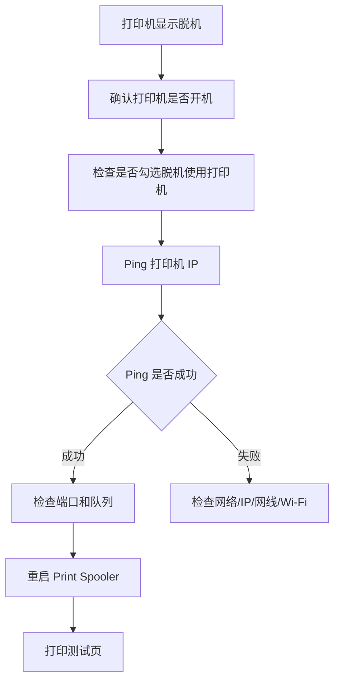

# 打印机脱机状态排查指南

> 适用于 Windows 环境中打印机显示“脱机”“需要注意”“无法连接”“不可用”，但打印机本身可能已经开机的情况。

---

## 适用场景

- 打印机图标变灰或显示“脱机”
- 打印任务进入队列后不打印
- Windows 提示“打印机脱机”
- 打印机实际已开机，但电脑仍然显示不可用
- 多台电脑中只有某一台无法打印
- 网络打印机 IP 变化后仍连接旧端口

---

## 一、打印机脱机是什么意思

“脱机”并不一定代表打印机坏了，通常表示：

```text
Windows 当前无法确认打印机处于可用状态
```

可能原因包括：

- 打印机未开机或处于休眠状态
- 电脑和打印机网络不通
- 打印机 IP 地址发生变化
- 当前端口仍指向旧 IP
- 使用了不稳定的 WSD 端口
- Windows 勾选了“脱机使用打印机”
- Print Spooler 服务异常
- 驱动异常或队列卡住

---

## 二、快速排查流程



---

## 三、取消“脱机使用打印机”

路径：

```text
控制面板
└── 设备和打印机
    └── 右键目标打印机
        └── 查看现在正在打印什么
            └── 打印机
                └── 取消勾选“脱机使用打印机”
```

同时建议检查：

```text
打印机
├── 脱机使用打印机：不要勾选
├── 暂停打印：不要勾选
└── 设为默认打印机：根据需要设置
```

---

## 四、检查打印机是否真的在线

### 1. 查看打印机面板

确认：

- 电源已打开
- 屏幕无错误提示
- 纸张正常
- 硒鼓/墨盒正常
- 网络图标正常
- 没有卡纸

### 2. 打印机休眠导致误判

部分网络打印机进入深度休眠后，Windows 可能短时间内显示脱机。

处理方法：

```text
按一下打印机任意按键
等待 10-30 秒
重新刷新设备和打印机窗口
重新打印测试页
```

---

## 五、检查当前端口

路径：

```text
控制面板
└── 设备和打印机
    └── 右键打印机
        └── 打印机属性
            └── 端口
```

重点检查：

```text
当前勾选端口是否正确
是否仍然使用 WSD 端口
TCP/IP 端口中的 IP 是否为打印机当前 IP
```

推荐：

```text
Standard TCP/IP Port
IP_打印机当前IP
```

不推荐长期依赖：

```text
WSD-xxxxxx
```

---

## 六、Ping 测试判断网络状态

假设打印机 IP 为：

```text
192.168.0.193
```

执行：

```cmd
ping 192.168.0.193
```

### Ping 成功

```text
Reply from 192.168.0.193
```

说明：

- 电脑到打印机网络基本连通
- 优先检查打印队列、端口、驱动、Print Spooler

### Ping 失败

```text
Request timed out
```

可能原因：

- 打印机未开机
- 打印机 IP 已变化
- 电脑和打印机不在同一网段
- 网线或 Wi-Fi 异常
- IP 冲突
- 网络设备拦截

---

## 七、脱机问题常见原因与处理

| 现象 | 常见原因 | 推荐处理 |
|---|---|---|
| 显示脱机，但打印机已开机 | Windows 状态未刷新 | 取消脱机使用打印机，重启队列 |
| 多台电脑都脱机 | 打印机网络或 IP 问题 | 检查打印机 IP、网线、Wi-Fi |
| 只有一台电脑脱机 | 本机端口或驱动异常 | 检查端口，重装驱动 |
| Ping 通但仍脱机 | 端口或队列异常 | 改用 TCP/IP，重启 Spooler |
| Ping 不通 | 网络不通或 IP 变化 | 查看打印机当前 IP |
| 反复脱机 | WSD 不稳定或 IP 自动变化 | 固定 IP + TCP/IP 端口 |

---

## 八、推荐处理顺序

```text
1. 确认打印机已开机
2. 检查是否卡纸、缺纸、缺墨/缺粉
3. 取消“脱机使用打印机”
4. Ping 打印机 IP
5. 检查打印机端口
6. 优先切换为 Standard TCP/IP Port
7. 重启 Print Spooler
8. 清空打印队列
9. 打印测试页
10. 必要时重装驱动
```

---

## 九、企业环境建议

为了减少打印机反复脱机，建议统一采用：

```text
打印机固定 IP 或 DHCP 保留
+
Standard TCP/IP Port
+
官方驱动
+
打印机信息登记表
```

不建议长期使用：

```text
自动获取变化 IP
WSD 自动发现端口
未知来源驱动
多人随意添加不同端口
```

---

## 十、排查记录模板

| 项目 | 内容 |
|---|---|
| 打印机型号 |  |
| 打印机位置 |  |
| 当前 IP |  |
| 当前端口 |  |
| 是否 Ping 通 |  |
| 是否 WSD 端口 |  |
| 是否 TCP/IP 端口 |  |
| 是否重启 Spooler |  |
| 是否清空队列 |  |
| 最终处理结果 |  |

---

## 总结

打印机脱机通常不是单一原因造成的，应优先从以下方向判断：

```text
状态设置
网络连通性
打印机 IP
端口配置
Print Spooler
驱动状态
```

在企业环境中，最稳定的方案通常是：

```text
固定 IP / DHCP 保留
↓
Standard TCP/IP Port
↓
官方驱动
↓
统一部署与登记
```
