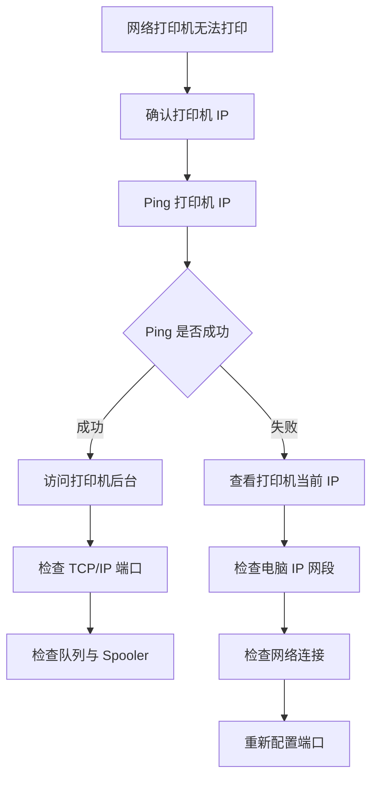

# Ping 网络检测与打印机连通性排查指南

> 适用于网络打印机无法打印、显示脱机、任务卡住、端口异常时，通过 Ping 和基础网络信息判断电脑与打印机是否连通。

---

## 适用场景

- 网络打印机无法打印
- 打印任务卡住但打印机无动作
- Windows 显示打印机脱机
- 怀疑打印机 IP 变化
- 多台电脑中部分电脑无法打印
- 需要判断是网络问题、端口问题还是驱动问题

---

## 一、Ping 能判断什么

Ping 是最基础的网络连通性检测命令。

它可以帮助判断：

```text
电脑是否能联系到打印机 IP
打印机是否在线
当前端口 IP 是否可能有效
网络是否存在明显中断
```

但 Ping 不能完全证明打印功能正常。因为打印还涉及：

```text
打印端口
打印协议
驱动
Print Spooler
打印队列
打印机自身状态
```

---

## 二、基本命令

假设打印机 IP 为：

```text
192.168.0.193
```

在 Windows 命令提示符执行：

```cmd
ping 192.168.0.193
```

打开命令提示符：

```text
Win + R
↓
cmd
↓
Enter
```

---

## 三、Ping 成功怎么判断

返回类似：

```text
Reply from 192.168.0.193: bytes=32 time<1ms TTL=255
```

说明：

```text
电脑到该 IP 的网络连通性基本正常
该 IP 上有设备响应
```

下一步优先检查：

```text
打印机端口是否正确
打印队列是否卡住
Print Spooler 是否异常
驱动是否正常
打印机是否缺纸、卡纸、缺粉
```

---

## 四、Ping 失败怎么判断

返回类似：

```text
Request timed out
```

可能原因：

```text
打印机未开机
打印机进入异常休眠
打印机 IP 已变化
电脑和打印机不在同一网段
网线或 Wi-Fi 异常
交换机或路由器异常
防火墙或网络策略限制
IP 冲突
```

下一步建议：

```text
查看打印机屏幕或网络配置页
确认当前 IP
检查网线/Wi-Fi
确认电脑 IP 网段
重新 Ping 新 IP
```

---

## 五、Ping 通但无法打印

这是很常见的情况。

说明：

```text
网络层基本正常
但打印服务链路仍可能异常
```

优先检查：

| 检查项 | 说明 |
|---|---|
| 端口 | 是否指向正确 IP |
| 端口类型 | 是否仍使用 WSD |
| 队列 | 是否有任务卡住 |
| Spooler | 服务是否异常 |
| 驱动 | 是否安装正确 |
| 打印机状态 | 是否缺纸、卡纸、缺粉 |

推荐处理：

```text
Ping 通
↓
打开打印机属性
↓
检查端口 IP
↓
重启 Print Spooler
↓
清空打印队列
↓
打印测试页
```

---

## 六、Ping 不通但打印机看起来在线

这种情况通常说明电脑并没有连到正确地址。

排查方向：

```text
1. 查看打印机当前 IP
2. 查看电脑当前 IP
3. 判断是否在同一网段
4. 检查端口是否仍指向旧 IP
5. 检查是否存在多个网络连接
6. 检查有线/Wi-Fi 是否连接到正确网络
```

例如：

```text
电脑 IP：192.168.1.50
打印机 IP：192.168.0.193
```

可能不在同一网段，需要检查网关和网络划分。

---

## 七、查看电脑 IP 信息

执行：

```cmd
ipconfig
```

或查看更完整信息：

```cmd
ipconfig /all
```

重点查看：

```text
IPv4 Address
Subnet Mask
Default Gateway
DNS Servers
```

示例：

```text
IPv4 Address . . . . . . . . . . : 192.168.0.88
Subnet Mask . . . . . . . . . . : 255.255.255.0
Default Gateway . . . . . . . . : 192.168.0.1
```

如果打印机为：

```text
192.168.0.193
```

通常说明在同一常见家庭/办公室网段内。

---

## 八、连续 Ping 检测稳定性

普通 Ping 只发送几次请求。可以使用连续 Ping：

```cmd
ping 192.168.0.193 -t
```

停止：

```text
Ctrl + C
```

用于判断：

```text
是否频繁丢包
是否网络不稳定
是否打印机休眠后断续响应
是否存在 IP 冲突
```

如果看到：

```text
一会儿 Reply
一会儿 Request timed out
```

可能原因：

```text
Wi-Fi 信号不稳定
IP 冲突
网线接触不良
交换机端口异常
打印机网卡异常
```

---

## 九、通过浏览器访问打印机后台

如果 Ping 通，可以尝试在浏览器输入：

```text
http://192.168.0.193
```

如果能打开打印机管理页面，说明：

```text
打印机网络在线
IP 地址大概率正确
可以继续检查 Windows 端口和驱动
```

如果打不开但 Ping 通，可能原因：

```text
打印机未开启 Web 管理
浏览器拦截
HTTPS/HTTP 地址不同
设备不是目标打印机
```

---

## 十、Ping 结果速查表

| Ping 结果 | 可能含义 | 下一步 |
|---|---|---|
| Reply 正常 | 网络基本通 | 检查端口、队列、驱动 |
| Request timed out | 网络不通或 IP 错 | 查看打印机当前 IP |
| Destination host unreachable | 本机无法到达目标网段 | 检查电脑网络和网关 |
| General failure | 本机网络异常 | 重启网卡或检查网络配置 |
| 间歇性超时 | 网络不稳定或 IP 冲突 | 连续 Ping，检查线路 |
| Ping 通但不能打印 | 非网络层问题 | 检查 Spooler、端口、驱动 |

---

## 十一、推荐排查流程



---

## 十二、常用命令速查

```cmd
ping 192.168.0.193
ping 192.168.0.193 -t
ipconfig
ipconfig /all
arp -a
```

说明：

| 命令 | 用途 |
|---|---|
| ping | 测试网络连通性 |
| ping -t | 持续测试网络稳定性 |
| ipconfig | 查看电脑 IP 信息 |
| ipconfig /all | 查看详细网络信息 |
| arp -a | 查看本机缓存的 IP 与 MAC 对应关系 |

---

## 总结

Ping 是判断网络打印机问题的第一步，但不是最后一步。

推荐判断逻辑：

```text
Ping 不通
优先检查网络、IP、网段、线路、Wi-Fi。

Ping 通但无法打印
优先检查端口、打印队列、Print Spooler、驱动和打印机状态。
```

企业环境建议将 Ping 检测与以下配置结合使用：

```text
固定 IP / DHCP 保留
Standard TCP/IP Port
官方驱动
打印机设备登记表
```
