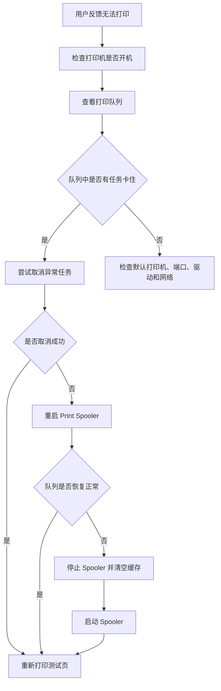

# 🧾 打印队列卡住、Print Spooler 与清空缓存指南


> 本文用于处理 Windows 环境下打印任务卡住、队列无法删除、打印机无反应、Print Spooler 服务异常以及需要清空打印缓存的常见问题。

---

## 📌 适用场景

当用户反馈以下问题时，可以优先参考本文：

- 点击打印后没有反应
- 打印任务一直停留在队列中
- 打印任务显示“正在打印”，但打印机不工作
- 删除打印任务后一直显示“正在删除”
- 测试页无法打印
- 多个文档排队后全部卡住
- 重启打印机后仍无法打印
- Windows 显示打印机“需要注意”

---

## 🧠 基本原理

Windows 打印任务通常不会直接发送到打印机，而是先进入系统的打印队列。这个队列由 **Print Spooler** 服务负责管理。

可以简单理解为：

```text
应用程序
  ↓
Windows 打印队列
  ↓
Print Spooler 服务
  ↓
打印机驱动 / 打印端口
  ↓
打印机
```

如果 Print Spooler 服务异常、某个打印任务损坏、驱动响应异常或端口通信失败，就可能导致打印任务一直卡在队列中。

---

## 🚨 常见故障表现

| 现象 | 可能原因 | 优先处理 |
|---|---|---|
| 打印任务一直不动 | Print Spooler 异常 | 重启 Spooler |
| 任务无法删除 | 队列文件被占用 | 停止 Spooler 后清空缓存 |
| 多个任务全部卡住 | 第一个任务异常 | 清空队列 |
| 测试页也无法打印 | 系统打印服务或端口异常 | 重启 Spooler 后检查端口 |
| 打印机无任何反应 | 任务未成功发送到打印机 | 检查队列、服务、端口 |
| 删除后又自动出现 | 应用程序重复提交任务 | 关闭相关软件后再清理 |

---

## 🔍 排查流程



---

## ✅ 第一步：查看打印队列

路径：

```text
控制面板
└── 设备和打印机
    └── 右键目标打印机
        └── 查看现在正在打印什么
```

重点检查：

- 是否有任务一直显示“正在打印”
- 是否有任务一直显示“正在删除”
- 是否有大量重复任务
- 是否选择了错误的打印机
- 是否勾选了“暂停打印”或“脱机使用打印机”

---

## ✅ 第二步：尝试取消异常任务

在打印队列窗口中：

```text
右键异常任务
└── 取消
```

如果任务可以正常删除，再重新打印测试页。

如果任务无法删除，或者一直显示“正在删除”，说明队列文件可能被 Print Spooler 服务占用，需要继续执行后续步骤。

---

## ✅ 第三步：重启 Print Spooler

### 方法一：图形界面重启

```text
Win + R
↓
services.msc
↓
找到 Print Spooler
↓
右键
↓
重新启动
```

适合普通用户或不熟悉命令行的场景。

### 方法二：命令行重启

以管理员身份打开命令提示符，执行：

```cmd
net stop spooler
net start spooler
```

执行完成后，再打开打印队列查看任务是否恢复正常。

---

## ✅ 第四步：清空 Windows 打印缓存

如果重启 Print Spooler 后，卡住的任务仍然存在，建议清空打印缓存。

### 操作前注意事项

清空缓存会删除当前电脑上所有未完成的打印任务。执行前应确认：

- 用户不再需要当前队列中的任务
- 已保存需要重新打印的文件
- 知道后续需要重新提交打印任务

---

## 🧹 命令行清空缓存

以管理员身份打开命令提示符，执行：

```cmd
net stop spooler
del /Q /F %systemroot%\System32\spool\PRINTERS\*.*
net start spooler
```

命令含义：

| 命令 | 作用 |
|---|---|
| `net stop spooler` | 停止 Print Spooler 服务 |
| `del /Q /F ...` | 强制静默删除打印缓存文件 |
| `net start spooler` | 重新启动 Print Spooler 服务 |

---

## 🧹 手动方式清空缓存

如果不想直接使用删除命令，也可以手动操作。

### 1. 停止 Print Spooler

```text
Win + R
↓
services.msc
↓
Print Spooler
↓
停止
```

### 2. 打开缓存目录

路径：

```text
C:\Windows\System32\spool\PRINTERS
```

如果系统提示需要管理员权限，选择继续。

### 3. 删除目录内文件

删除 `PRINTERS` 文件夹中的所有文件，但不要删除 `PRINTERS` 文件夹本身。

### 4. 启动 Print Spooler

```text
services.msc
↓
Print Spooler
↓
启动
```

---

## 🧪 第五步：重新打印测试页

路径：

```text
控制面板
└── 设备和打印机
    └── 右键目标打印机
        └── 打印机属性
            └── 打印测试页
```

判断结果：

| 测试结果 | 说明 | 下一步 |
|---|---|---|
| 测试页成功打印 | 队列和 Spooler 已恢复 | 让用户重新打印原文件 |
| 测试页仍失败 | 问题可能不在队列 | 检查端口、驱动、网络 |
| 测试页卡住 | Spooler、驱动或端口仍异常 | 继续排查驱动和端口 |

---

## 🧭 如何判断问题范围

### 只有某个文件无法打印

可能原因：

- 文件太大
- PDF 渲染异常
- 文档页面尺寸异常
- 软件本身卡住

建议：

- 换一个简单文档测试
- 用记事本打印测试
- PDF 尝试“作为图像打印”
- 关闭软件后重新打开

### 所有文件都无法打印

可能原因：

- Print Spooler 异常
- 打印队列损坏
- 驱动异常
- 打印端口异常
- 打印机网络不通

建议：

- 重启 Spooler
- 清空打印缓存
- 检查端口
- Ping 打印机 IP
- 必要时重装驱动

---

## ⚠️ 常见注意事项

### 不要直接反复点击打印

如果第一个任务已经卡住，继续点击打印只会堆积更多任务，增加清理难度。

### 不要只重启打印机

打印任务卡在 Windows 队列时，问题可能在电脑端。单独重启打印机不一定能解决。

### 清空缓存前要提醒用户

清空缓存会删除所有未完成任务，需要用户重新提交打印。

### 多台电脑无法打印时，不要只检查一台电脑

如果同一台网络打印机在多台电脑上都无法打印，可能是打印机、网络、IP 或端口问题。

---

## 🏢 企业环境建议

建议 IT 部门建立标准处理流程：

- 统一使用 Standard TCP/IP Port
- 尽量避免长期依赖 WSD 自动发现端口
- 为网络打印机设置固定 IP 或 DHCP 保留
- 统一安装官方驱动
- 建立打印机信息登记表
- 保留常用清理脚本
- 对 Helpdesk 人员提供固定排查步骤

---

## 🧰 可保存为批处理脚本

可将以下内容保存为：

```text
scripts/windows/clear-printer-queue.bat
```

内容：

```bat
@echo off
echo 正在停止 Print Spooler 服务...
net stop spooler

echo 正在清空 Windows 打印缓存...
del /Q /F %systemroot%\System32\spool\PRINTERS\*.*

echo 正在启动 Print Spooler 服务...
net start spooler

echo 打印队列缓存清理完成。
pause
```

---

## 🧾 快速速查表

| 问题 | 快速处理 |
|---|---|
| 打印任务卡住 | 取消任务，重启 Spooler |
| 任务无法删除 | 停止 Spooler 后清空缓存 |
| 打印队列一直显示正在删除 | 清空 `spool\PRINTERS` 缓存 |
| 测试页无法打印 | 先清队列，再查端口和驱动 |
| 只有 PDF 打不出 | 换阅读器或使用图像方式打印 |
| 多台电脑都不能打印 | 检查打印机 IP、网络和端口 |

---

## ✅ 总结

打印队列卡住时，建议优先按照以下顺序处理：

```text
查看队列
↓
取消异常任务
↓
重启 Print Spooler
↓
清空 spool 打印缓存
↓
重新打印测试页
↓
继续检查端口、驱动和网络
```

这个流程可以解决大多数 Windows 打印任务卡住、任务无法删除和 Print Spooler 异常导致的打印问题。

---

## 📚 关键词

```text
Print Spooler
Printer Queue
Windows Printer
Spool Cache
Clear Printer Queue
Printer Troubleshooting
IT Support
Helpdesk
```
